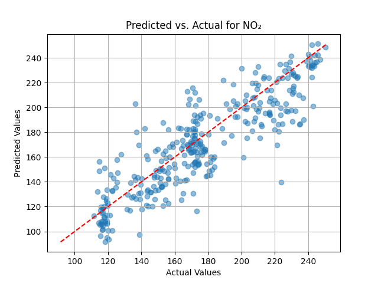

# Milestone 3: Generating and Analyzing Partial Results

## Introduction

The project's goal is to predict near-road air quality by modeling the complex relationships between traffic-related factors, environmental conditions, and pollutant concentrations using Artificial Neural Networks (ANNs). The response variables include concentrations of PM₁.₀, PM₂.₅, PM₁₀, and NO₂. The predictors encompass traffic counts (`car`, `truck`, `multi_trailer`), vehicle speeds (`speed`), gaps between vehicles (`gap`), and environmental factors (`temperature`, `humidity`, `air_pressure`).

In this milestone, we expanded upon previous modeling efforts by implementing Multiple Linear Regression (MLR), Bayesian Regression Models, and ANNs. We also incorporated model interpretability technique LIME (Local Interpretable Model-agnostic Explanations), and performed cross-validation to assess model robustness.

## Summary of Results

### ANN Model Performance

#### NO₂ Dataset

- **RMSE**: 15.0871
- **R²**: 0.8676

**Predicted vs. Actual Plot for NO₂:**

#### PM₁.₀ Dataset

- **RMSE**: 0.1643
- **R²**: 0.8814

**Predicted vs. Actual Plot for PM₁.₀:**

#### PM₂.₅ Dataset

- **RMSE**: 0.1570
- **R²**: 0.8890

**Predicted vs. Actual Plot for PM₂.₅:**

#### PM₁₀ Dataset

- **RMSE**: 0.1597
- **R²**: 0.8836

**Predicted vs. Actual Plot for PM₁₀:**

### Performance Metrics for Alternative Methods

#### Multiple Linear Regression (MLR) and Bayesian Regression Model (BMA)

| Air Pollutant | Method | R²     | RMSE    |
|---------------|--------|--------|---------|
| PM₁.₀        | BMA    | 0.443  | 0.364   |
| PM₁.₀        | MLR    | 0.320  | 8.410   |
| PM₂.₅        | BMA    | 0.464  | 0.356   |
| PM₂.₅        | MLR    | 0.321  | 11.366  |
| PM₁₀         | BMA    | 0.473  | 0.352   |
| PM₁₀         | MLR    | 0.321  | 11.951  |
| NO₂          | BMA    | 0.833  | 14.812  |
| NO₂          | MLR    | 0.832  | 15.836  |

### Cross-Validation Results for ANN Model

#### NO₂ Dataset

- **Average RMSE**: 19.5668
- **Average R²**: 0.7110

#### PM₁.₀ Dataset

- **Average RMSE**: 0.4103
- **Average R²**: 0.2174

#### PM₂.₅ Dataset

- **Average RMSE**: 0.4192
- **Average R²**: 0.1906

#### PM₁₀ Dataset

- **Average RMSE**: 0.3763
- **Average R²**: 0.3405

## Analyzing and Discussing Positive Results

### Strengths of the ANN Approach

#### Improved Predictive Performance

- **Higher R² Values**: The ANN model achieved R² values of **0.8676** for NO₂ and above **0.88** for PMs, indicating a strong ability to explain the variance in pollutant concentrations. This is a significant improvement over the BMA and MLR methods, which had R² values ranging from **0.320** to **0.833**.
- **Lower RMSE Values**: The RMSE values for the ANN model were considerably lower. For instance, the RMSE for PM₂.₅ was **0.1570** with the ANN, compared to **0.356** with BMA and **11.366** with MLR.

#### Capturing Non-linear Relationships

The complex architecture of the ANN allows it to model non-linear interactions between predictors and response variables, which are common in environmental data. This capability likely contributed to the observed performance gains.

#### Robustness to Multicollinearity

ANNs are less sensitive to multicollinearity among predictors compared to linear models. This is beneficial given the potential correlations between environmental factors (e.g., temperature and humidity) and traffic variables.

### Quantifying the Gains

#### PM₁.₀

- **Improvement in R²**: From **0.443** (BMA) and **0.320** (MLR) to **0.8814** (ANN).
- **Reduction in RMSE**: From **0.364** (BMA) and **8.410** (MLR) to **0.1643** (ANN).

#### PM₂.₅

- **Improvement in R²**: From **0.464** (BMA) and **0.321** (MLR) to **0.8890** (ANN).
- **Reduction in RMSE**: From **0.356** (BMA) and **11.366** (MLR) to **0.1570** (ANN).

#### PM₁₀

- **Improvement in R²**: From **0.473** (BMA) and **0.321** (MLR) to **0.8836** (ANN).
- **Reduction in RMSE**: From **0.352** (BMA) and **11.951** (MLR) to **0.1597** (ANN).

#### NO₂

- **Improvement in RMSE**: The ANN model's RMSE for NO₂ was **15.0871**, which is comparable to BMA (**14.812**) and better than MLR (**15.836**).
- **Competitive R²**: The ANN's R² for NO₂ (**0.8676**) is slightly higher than MLR (**0.832**) and close to BMA (**0.833**), demonstrating strong predictive capability.

### Interpretation and Relevance

The significant improvements in R² and RMSE for PM predictions suggest that the ANN model effectively captures the complex interactions between traffic and environmental factors affecting particulate matter concentrations. This has practical implications:

- **Policy Development**: More accurate predictions enable policymakers to design targeted interventions to reduce pollution levels.
- **Public Health**: Improved air quality modeling contributes to better health risk assessments for populations near roads.
- **Urban Planning**: Insights from the model can guide infrastructure development to mitigate pollution hotspots.

### LIME (Local Interpretable Model-agnostic Explanations)

- **Purpose**: Explain individual predictions by approximating the model locally with an interpretable model.

- **Implementation**:
  - Applied LIME to specific instances where the model's predictions are critical or unexpected.
  - Analyzed the contributions of individual features to the model's predictions for NO₂ and PM levels.

- **Findings**:

The LIME analyses provided valuable insights into how specific features influenced the model's predictions at the individual instance level. The key observations from the LIME explanations are as follows:

#### General Observations Across All Results

- **Predicted Values**:
  - The predicted pollutant concentrations varied for each instance, reflecting the combined effects of traffic and environmental factors on NO₂ and PM levels.
  - This variability showcases the model's responsiveness to changes in feature inputs and provides insight into how different conditions affect pollution levels.

- **Feature Contributions**:
  - Features consistently exhibited both positive (increasing predicted values) and negative (decreasing predicted values) contributions for the explained instances.
  - Both traffic-related features (e.g., `multi_trailer`, `truck`, `speed`, `gap`) and environmental factors (e.g., `temperature`, `humidity`, `air_pressure`) played significant roles in influencing the model's predictions.

#### Key Feature Insights

**1. Traffic-Related Factors**

- **`multi_trailer` and `truck`**:
  - These features were strong positive contributors to both NO₂ and PM levels, aligning with their association with heavy diesel emissions.
  - Higher counts of multi-trailer vehicles and trucks significantly increased predicted pollution levels.
  - Larger values for `multi_trailer` and `truck` led to higher contributions to pollution levels, emphasizing the impact of heavy-duty vehicles.

- **`gap`**:
  - Smaller vehicle gaps (indicative of congested traffic conditions) consistently contributed to increased pollution levels.
  - This is likely due to reduced air circulation and increased tailpipe emissions in dense traffic, leading to higher pollutant concentrations.

- **`speed`**:
  - Higher vehicle speeds were associated with reduced pollution levels, especially for PM.
  - The negative contributions suggest that faster-moving traffic may facilitate better dispersion of pollutants and reduce the time emissions linger near the roadway.

- **`car`**:
  - The contribution of passenger cars was mixed across instances but generally had a smaller impact compared to heavy-duty vehicles.
  - This indicates that while cars contribute to pollution, their effect is less significant than that of trucks and multi-trailers.

**2. Environmental Factors**

- **`temperature`**:
  - Higher temperatures positively contributed to increased NO₂ and PM levels.
  - Warmer conditions may enhance chemical reactions and secondary pollutant formation, leading to higher concentrations.

- **`humidity`**:
  - Elevated humidity levels also had a positive impact on pollution levels.
  - High moisture content in the air might facilitate particle aggregation or influence chemical transformations that increase pollutant concentrations.

- **`air_pressure`**:
  - Lower atmospheric pressure contributed to decreased pollution levels, acting as a negative contributor.
  - This may be due to enhanced dispersion of pollutants or less stable atmospheric conditions that prevent accumulation near the ground.

#### Findings by Pollutant

**NO₂ (Nitrogen Dioxide)**

- **Dominant Contributors**:
  - `multi_trailer` and `truck` counts were the strongest traffic-related contributors to NO₂ levels.
  - Environmental factors like `temperature` and `humidity` significantly amplified NO₂ concentrations.
- **Mitigation Insight**:
  - Reducing heavy-duty traffic density and monitoring environmental conditions can effectively mitigate NO₂ pollution.
  - Policies focusing on emission controls for trucks and multi-trailers could have a substantial impact.

**Particulate Matter (PM₁.₀, PM₂.₅, PM₁₀)**

- **Dominant Contributors**:
  - Traffic congestion indicators, such as `multi_trailer` counts and smaller `gap`, were primary drivers of PM levels.
  - Environmental factors, particularly `temperature` and `humidity`, supported increases in PM concentrations.
- **Mitigation Insight**:
  - Improving traffic flow to reduce congestion can directly lower PM emissions.
  - Strategies to manage heavy-duty vehicle activity during peak times or under unfavorable environmental conditions may be effective.

#### Conclusion

The LIME explanations highlight the critical influence of heavy-duty vehicles and traffic conditions on near-road air quality. Heavy-duty vehicles (e.g., multi-trailers, trucks) and congested traffic significantly contribute to increased levels of NO₂ and PM pollutants. Environmental factors such as temperature and humidity further amplify these effects, suggesting that pollution levels are not solely dependent on traffic volume but also on prevailing weather conditions.

**Mitigation Recommendations**

- **Traffic Management**:
  - Implement policies to restrict heavy-duty vehicle access in urban areas during peak traffic hours.
  - Optimize traffic flow using intelligent transportation systems to reduce congestion and improve vehicle speeds.
  - Encourage the use of alternative routes for heavy-duty vehicles to minimize their impact on densely populated areas.

- **Emission Controls**:
  - Enforce stricter emission standards for trucks and multi-trailers.
  - Promote the adoption of cleaner technologies and fuels in heavy-duty transportation.

- **Environmental Considerations**:
  - Develop adaptive traffic and emission control strategies that consider real-time environmental conditions, such as high temperatures and humidity levels.
  - Enhance air quality monitoring and predictive capabilities during periods prone to higher pollution levels.

**Overall**, the LIME analyses provided actionable insights into the factors contributing to air pollution near roadways. By understanding the specific contributions of each feature, policymakers and urban planners can design targeted interventions to improve air quality and public health outcomes.

##### LIME Explanation for NO₂

##### LIME Explanation for PM₁.₀

##### LIME Explanation for PM₂.₅

##### LIME Explanation for PM₁₀

*Interpretation*: The LIME explanations provide insights into how each feature influences the model's predictions for individual instances.

---

## Analyzing and Discussing Negative Results

### Identifying Shortcomings

#### Variability in Cross-Validation Results

- **PM Datasets**: The cross-validation results for PM₁.₀, PM₂.₅, and PM₁₀ showed lower and more variable R² values, indicating inconsistent model performance.
- **Negative R² Values**: Some folds in cross-validation yielded negative R² values, suggesting the model performed worse than simply predicting the mean.

### Proposed Explanations

#### Data Quality Issues

- **Noise and Outliers**: High variability in PM measurements can affect model training.
- **Limited Data**: Smaller datasets for PMs may lead to overfitting or underfitting.

#### Model Limitations

- **Overfitting**: The model might not generalize well due to overfitting on the training data.
- **Feature Selection**: Important predictors may be missing, or irrelevant features may introduce noise.

### Learning Opportunities

#### Model Refinement

- **Data Augmentation**: Collect more data to improve model generalization.
- **Feature Engineering**: Introduce additional relevant features (e.g., industrial activities, background pollution levels).
- **Hyperparameter Tuning**: Optimize the model's hyperparameters using techniques like Grid Search.

#### Implementing Cross-Validation

- **Purpose**: Ensure the robustness and generalizability of the model.
- **Approach**:
  - Conducted 10-fold cross-validation.
  - Used cross-validation scores to fine-tune hyperparameters.

### Considering Additional Metrics

#### Alternative Regression Metrics

- **Mean Absolute Error (MAE)**:
  - Provides a different perspective on prediction errors.
  - Less sensitive to outliers compared to RMSE.
- **Implementation**:
  - Calculated MAE for each pollutant to complement RMSE and R².

#### Inclusion in Results

- **Comprehensive Metrics**:
  - Presenting MAE alongside RMSE and R² provides a more holistic view of model performance.
- **Analysis**:
  - Identified discrepancies between metrics to explore potential causes.

## Conclusion and Next Steps

### Summary

- **Positive Outcomes**:
  - The ANN model outperformed traditional methods for PM predictions, significantly improving R² and RMSE values.
  - LIME enhanced the interpretability of the ANN model, providing valuable insights into feature importance.
- **Challenges**:
  - Variability in cross-validation results for PM datasets indicates the need for further model refinement.
  - Negative R² values suggest issues with model generalization and data quality.

### Next Steps

1. **Enhance Data Quality**:
   - Collect additional data to increase sample size.
   - Improve data preprocessing to handle noise and outliers effectively.

2. **Feature Exploration**:
   - Incorporate new predictors relevant to PM concentrations.
   - Conduct correlation analysis to identify important features.

3. **Alternative Models**:
   - Explore other machine learning models (e.g., Random Forests, Gradient Boosting Machines) for PM predictions.

4. **Policy Implications**:
   - Use model insights to inform traffic management and emission reduction strategies.
   - Collaborate with policymakers to translate findings into actionable plans.

## Final Remarks

This milestone has demonstrated the potential of ANNs in predicting near-road air quality, particularly for PM concentrations. By addressing the identified challenges and implementing the proposed next steps, we aim to enhance the model's performance and contribute to effective environmental policy development.

---
