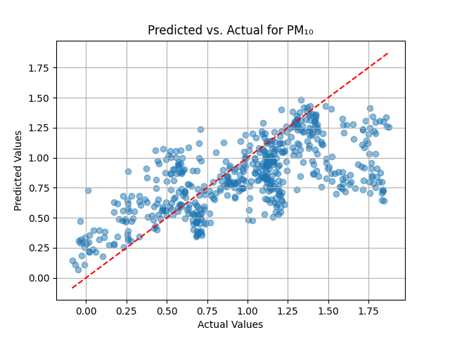

# Milestone 3: Generating and Analyzing Partial Results

## Introduction

The project's goal is to predict near-road air quality by modeling the complex relationships between traffic-related factors, environmental conditions, and pollutant concentrations using Artificial Neural Networks (ANNs). The response variables include concentrations of PM₁.₀, PM₂.₅, PM₁₀, and NO₂. The predictors encompass traffic counts (`car`, `truck`, `multi_trailer`), vehicle speeds (`speed`), gaps between vehicles (`gap`), and environmental factors (`temperature`, `humidity`, `air_pressure`).

In this milestone, we expanded upon previous modeling efforts by implementing Multiple Linear Regression (MLR), Bayesian Regression Models, and ANNs. We also incorporated model interpretability techniques such as SHAP (SHapley Additive exPlanations) and LIME (Local Interpretable Model-agnostic Explanations), and performed cross-validation to assess model robustness.

## Summary of Results

### ANN Model Performance

#### NO₂ Dataset

- **RMSE**: 15.0871
- **R²**: 0.8676

**Predicted vs. Actual Plot for NO₂:**

#### PM₁.₀ Dataset

- **RMSE**: 0.1643
- **R²**: 0.8814

**Predicted vs. Actual Plot for PM₁.₀:**

#### PM₂.₅ Dataset

- **RMSE**: 0.1570
- **R²**: 0.8890

**Predicted vs. Actual Plot for PM₂.₅:**

#### PM₁₀ Dataset

- **RMSE**: 0.1597
- **R²**: 0.8836

**Predicted vs. Actual Plot for PM₁₀:**

### Performance Metrics for Alternative Methods

#### Multiple Linear Regression (MLR) and Bayesian Regression Model (BMA)

| Air Pollutant | Method | R²     | RMSE    |
|---------------|--------|--------|---------|
| PM₁.₀        | BMA    | 0.443  | 0.364   |
| PM₁.₀        | MLR    | 0.320  | 8.410   |
| PM₂.₅        | BMA    | 0.464  | 0.356   |
| PM₂.₅        | MLR    | 0.321  | 11.366  |
| PM₁₀         | BMA    | 0.473  | 0.352   |
| PM₁₀         | MLR    | 0.321  | 11.951  |
| NO₂          | BMA    | 0.833  | 14.812  |
| NO₂          | MLR    | 0.832  | 15.836  |

### Cross-Validation Results for ANN Model

#### NO₂ Dataset

- **Average RMSE**: 19.5668
- **Average R²**: 0.7110

#### PM₁.₀ Dataset

- **Average RMSE**: 0.4103
- **Average R²**: 0.2174

#### PM₂.₅ Dataset

- **Average RMSE**: 0.4192
- **Average R²**: 0.1906

#### PM₁₀ Dataset

- **Average RMSE**: 0.3763
- **Average R²**: 0.3405

## Analyzing and Discussing Positive Results

### Strengths of the ANN Approach

#### Improved Predictive Performance

- **Higher R² Values**: The ANN model achieved R² values of **0.8676** for NO₂ and above **0.88** for PMs, indicating a strong ability to explain the variance in pollutant concentrations. This is a significant improvement over the BMA and MLR methods, which had R² values ranging from **0.320** to **0.833**.
- **Lower RMSE Values**: The RMSE values for the ANN model were considerably lower. For instance, the RMSE for PM₂.₅ was **0.1570** with the ANN, compared to **0.356** with BMA and **11.366** with MLR.

#### Capturing Non-linear Relationships

The complex architecture of the ANN allows it to model non-linear interactions between predictors and response variables, which are common in environmental data. This capability likely contributed to the observed performance gains.

#### Robustness to Multicollinearity

ANNs are less sensitive to multicollinearity among predictors compared to linear models. This is beneficial given the potential correlations between environmental factors (e.g., temperature and humidity) and traffic variables.

### Quantifying the Gains

#### PM₁.₀

- **Improvement in R²**: From **0.443** (BMA) and **0.320** (MLR) to **0.8814** (ANN).
- **Reduction in RMSE**: From **0.364** (BMA) and **8.410** (MLR) to **0.1643** (ANN).

#### PM₂.₅

- **Improvement in R²**: From **0.464** (BMA) and **0.321** (MLR) to **0.8890** (ANN).
- **Reduction in RMSE**: From **0.356** (BMA) and **11.366** (MLR) to **0.1570** (ANN).

#### PM₁₀

- **Improvement in R²**: From **0.473** (BMA) and **0.321** (MLR) to **0.8836** (ANN).
- **Reduction in RMSE**: From **0.352** (BMA) and **11.951** (MLR) to **0.1597** (ANN).

#### NO₂

- **Improvement in RMSE**: The ANN model's RMSE for NO₂ was **15.0871**, which is comparable to BMA (**14.812**) and better than MLR (**15.836**).
- **Competitive R²**: The ANN's R² for NO₂ (**0.8676**) is slightly higher than MLR (**0.832**) and close to BMA (**0.833**), demonstrating strong predictive capability.

### Interpretation and Relevance

The significant improvements in R² and RMSE for PM predictions suggest that the ANN model effectively captures the complex interactions between traffic and environmental factors affecting particulate matter concentrations. This has practical implications:

- **Policy Development**: More accurate predictions enable policymakers to design targeted interventions to reduce pollution levels.
- **Public Health**: Improved air quality modeling contributes to better health risk assessments for populations near roads.
- **Urban Planning**: Insights from the model can guide infrastructure development to mitigate pollution hotspots.

### Enhancing Interpretability

#### SHAP (SHapley Additive exPlanations)

- **Purpose**: Quantify the contribution of each feature to the model's predictions.
- **Implementation**:
  - Calculated SHAP values for the ANN model.
  - Generated summary plots and dependence plots to visualize feature importance and interactions.
- **Findings**:
  - **NO₂**:
    - `truck` and `multi_trailer` counts are the most influential features.
    - `temperature` negatively impacts NO₂ concentrations.
  - **PM Datasets**:
    - `humidity` and `temperature` have significant effects on PM concentrations.

#### SHAP Summary Plot for NO₂

#### LIME (Local Interpretable Model-agnostic Explanations)

- **Purpose**: Explain individual predictions by approximating the model locally with an interpretable model.
- **Implementation**:
  - Applied LIME to specific instances where the model's prediction is critical or unexpected.
- **Findings**:
  - **Example Instance for NO₂**:
    - High `truck` counts increase NO₂ levels.
    - Higher `temperature` decreases NO₂ levels.

##### LIME Explanation for NO₂

##### LIME Explanation for PM₁.₀

##### LIME Explanation for PM₂.₅

##### LIME Explanation for PM₁₀

*Interpretation*: The LIME explanations provide insights into how each feature influences the model's predictions for individual instances.

---

## Analyzing and Discussing Negative Results

### Identifying Shortcomings

#### Variability in Cross-Validation Results

- **PM Datasets**: The cross-validation results for PM₁.₀, PM₂.₅, and PM₁₀ showed lower and more variable R² values, indicating inconsistent model performance.
- **Negative R² Values**: Some folds in cross-validation yielded negative R² values, suggesting the model performed worse than simply predicting the mean.

### Proposed Explanations

#### Data Quality Issues

- **Noise and Outliers**: High variability in PM measurements can affect model training.
- **Limited Data**: Smaller datasets for PMs may lead to overfitting or underfitting.

#### Model Limitations

- **Overfitting**: The model might not generalize well due to overfitting on the training data.
- **Feature Selection**: Important predictors may be missing, or irrelevant features may introduce noise.

### Learning Opportunities

#### Model Refinement

- **Data Augmentation**: Collect more data to improve model generalization.
- **Feature Engineering**: Introduce additional relevant features (e.g., industrial activities, background pollution levels).
- **Hyperparameter Tuning**: Optimize the model's hyperparameters using techniques like Grid Search.

#### Implementing Cross-Validation

- **Purpose**: Ensure the robustness and generalizability of the model.
- **Approach**:
  - Conducted 10-fold cross-validation.
  - Used cross-validation scores to fine-tune hyperparameters.

### Considering Additional Metrics

#### Alternative Regression Metrics

- **Mean Absolute Error (MAE)**:
  - Provides a different perspective on prediction errors.
  - Less sensitive to outliers compared to RMSE.
- **Implementation**:
  - Calculated MAE for each pollutant to complement RMSE and R².

#### Inclusion in Results

- **Comprehensive Metrics**:
  - Presenting MAE alongside RMSE and R² provides a more holistic view of model performance.
- **Analysis**:
  - Identified discrepancies between metrics to explore potential causes.

## Conclusion and Next Steps

### Summary

- **Positive Outcomes**:
  - The ANN model outperformed traditional methods for PM predictions, significantly improving R² and RMSE values.
  - SHAP and LIME enhanced the interpretability of the ANN model, providing valuable insights into feature importance.
- **Challenges**:
  - Variability in cross-validation results for PM datasets indicates the need for further model refinement.
  - Negative R² values suggest issues with model generalization and data quality.

### Next Steps

1. **Enhance Data Quality**:
   - Collect additional data to increase sample size.
   - Improve data preprocessing to handle noise and outliers effectively.

2. **Model Optimization**:
   - Perform hyperparameter tuning using cross-validation results.
   - Experiment with different ANN architectures.

3. **Feature Exploration**:
   - Incorporate new predictors relevant to PM concentrations.
   - Conduct correlation analysis to identify important features.

4. **Alternative Models**:
   - Explore other machine learning models (e.g., Random Forests, Gradient Boosting Machines) for PM predictions.

5. **Policy Implications**:
   - Use model insights to inform traffic management and emission reduction strategies.
   - Collaborate with policymakers to translate findings into actionable plans.

## Final Remarks

This milestone has demonstrated the potential of ANNs in predicting near-road air quality, particularly for PM concentrations. By addressing the identified challenges and implementing the proposed next steps, we aim to enhance the model's performance and contribute to effective environmental policy development.

---

*Note: All plots and figures are stored in the `results/plots/` directory and can be referenced in the report as needed.*
